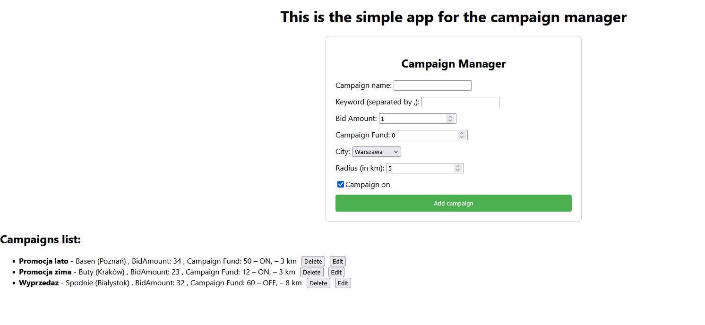

# JAVA-Spring-CRUD

## Campaign Manager

A simple full-stack web application for managing advertising campaigns. It allows sellers to create, edit, delete, and list their campaigns with full CRUD functionality.

## Features:

- Create, edit, delete, and view campaigns
- RESTful API using Spring Boot
- React frontend with form validation
- H2 in-memory database
- Validation for all fields (backend + frontend)
- Live update of campaigns list

##  Technologies Used

### Backend:

- Java 17+
- Spring Boot
- Spring Validation (Jakarta)
- H2 Database 
- Spring Data JPA

### Frontend:
- React (with functional components)

### Requirements

- Java 17+
- Node.js & npm
- Maven

## How to Run app:

### Backend (Spring Boot - API)

After cloning repository navigate to the campaignmanager folder in your IDE (e.g., IntelliJ IDEA) and run the main class:

CampaignmanagerApplication.java

If you do not have IDE, then you can use Maven from terminal to run it:

`cd campaignmanager`

`mvn spring-boot:run`

You can test the API directly via (once running):

http://localhost:8080/api/campaigns (REST endpoint)

### Frontend (React App)
In your terminal, navigate to the directory containing the campaign-manager-frontend folder and run:

`cd campaign-manager-frontend`

`npm install`

`npm start`

This will start the React frontend at:

http://localhost:3000

## Usage
The frontend communicates with the backend REST API. You can create, edit, delete, and view campaigns directly from the browser interface. Database update live when you doing something with your products in app.

Example screen of working app:

